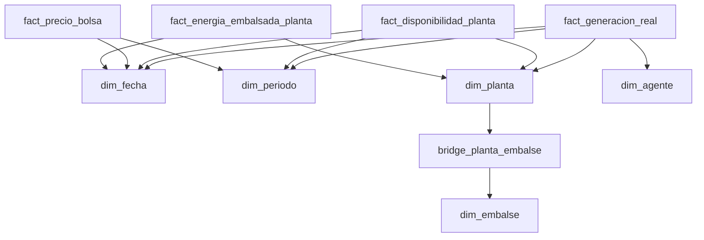
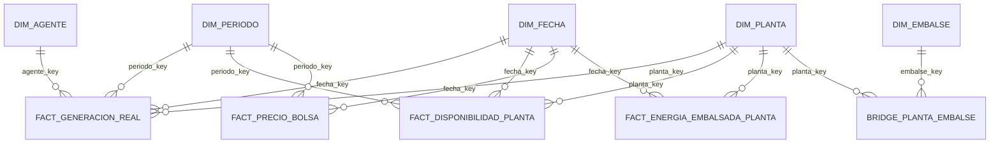

# Arquitectura y decisiones de diseño de la capa Gold

**Proyecto:** Observatorio Ciudadano de la Realidad de Colombia — Dominio de energía  
**Plataforma:** Databricks Lakehouse con Delta Lake  
**Patrón dimensional:** Constelación de hechos (*fact constellation*)  
**Documento:** Diseño, decisiones, justificación y validación técnica  
**Fecha de revisión:** 16 de julio de 2026  
**Notebook auditado:** `GOLD_LOAD (4).ipynb`

---

## 1. Propósito del documento

Este documento explica de forma integral cómo se diseñó la capa Gold del dominio de energía, por qué se tomaron las decisiones implementadas y qué problemas de modelado resuelve cada componente.

El objetivo no es describir solamente las tablas. También documenta:

- por qué la capa Gold usa un modelo dimensional;
- por qué se escogió una constelación de hechos y no una única tabla;
- cómo se definió el grano de cada hecho;
- por qué algunas dimensiones usan SCD Tipo 2 y otras SCD Tipo 1;
- por qué se necesitaron miembros inferidos en `dim_planta`;
- cómo se consolidan las versiones TX;
- por qué se utilizan claves sustitutas y claves determinísticas;
- cómo se resolvió la relación muchos a muchos entre plantas y embalses;
- qué validaciones demuestran que la carga es consistente;
- qué limitaciones deben conocer los consumidores analíticos;
- qué mejoras corresponden a una fase posterior de endurecimiento para producción.

---

## 2. Estado final de la implementación

La capa Gold está completa para el alcance funcional actual del MVP.

El modelo contiene:

- **5 dimensiones**
- **4 tablas de hechos**
- **1 tabla puente**
- vistas temporales de staging;
- reglas de selección de versiones;
- cargas incrementales mediante `MERGE`;
- validaciones de unicidad, cobertura dimensional e integridad referencial lógica.

### 2.1 Objetos Gold

| Tipo | Objeto | Función principal |
|---|---|---|
| Dimensión | `gold.dim_fecha` | Contexto calendario para análisis diarios, mensuales, trimestrales y anuales |
| Dimensión | `gold.dim_periodo` | Contexto de los 24 periodos horarios de un día |
| Dimensión | `gold.dim_agente` | Historial de agentes y su actividad |
| Dimensión | `gold.dim_planta` | Historial descriptivo de plantas y recursos operativos |
| Dimensión | `gold.dim_embalse` | Catálogo descriptivo y geográfico de embalses |
| Hecho | `gold.fact_generacion_real` | Generación real horaria por planta y agente |
| Hecho | `gold.fact_disponibilidad_planta` | Disponibilidad real horaria por planta |
| Hecho | `gold.fact_precio_bolsa` | Precios horarios de bolsa |
| Hecho | `gold.fact_energia_embalsada_planta` | Energía embalsada diaria reportada por planta |
| Puente | `gold.bridge_planta_embalse` | Relación potencialmente muchos a muchos entre plantas y embalses |

### 2.2 Resultados de la auditoría del notebook

| Validación | Resultado |
|---|---:|
| Plantas o recursos distintos en `dim_planta` | 2.240 |
| Registros provenientes del maestro de plantas | 2.068 |
| Miembros inferidos | 172 |
| Registros en `fact_generacion_real` | 2.393.184 |
| Registros en `fact_disponibilidad_planta` | 2.377.560 |
| Registros en `fact_precio_bolsa` | 4.272 |
| Registros en `fact_energia_embalsada_planta` | 3.738 |
| Relaciones planta–embalse | 23 |
| Plantas relacionadas en el puente | 20 |
| Embalses relacionados en el puente | 23 |
| Relaciones con atribución única | 18 |
| Relaciones pertenecientes a plantas multirreservorio | 5 |
| Claves duplicadas en los cuatro hechos | 0 |
| Plantas faltantes en los staging de hechos | 0 |
| Agentes faltantes en generación | 0 |
| Fechas o periodos faltantes | 0 |
| Relaciones sin dimensión en el puente | 0 |
| Relaciones de catálogo sin resolver | 0 |

### 2.3 Cobertura temporal validada

| Hecho | Fecha mínima | Fecha máxima |
|---|---|---|
| Generación real | 2026-01-01 00:00 | 2026-07-02 23:00 |
| Disponibilidad | 2026-01-01 00:00 | 2026-07-01 23:00 |
| Precio de bolsa | 2026-01-01 00:00 | 2026-06-27 23:00 |
| Energía embalsada | 2026-01-01 | 2026-06-27 |

---

## 3. Conceptos fundamentales

### 3.1 ¿Qué es la capa Gold?

Dentro de una arquitectura Medallion:

- **Bronze** conserva los datos recibidos con mínima transformación.
- **Silver** limpia, tipifica, estandariza y deduplica los datos.
- **Gold** organiza la información para responder preguntas analíticas y de negocio.

Gold no es simplemente una versión “más limpia” de Silver.

Silver responde:

> ¿Cómo dejamos el dato técnicamente confiable?

Gold responde:

> ¿Cómo organizamos el dato para analizar generación, disponibilidad, precio, agentes, plantas y embalses sin que cada consumidor deba reconstruir la lógica?

En Gold se fijan formalmente:

- definiciones de negocio;
- granularidad;
- relaciones;
- reglas históricas;
- selección de versiones;
- claves analíticas;
- restricciones de uso de las medidas.

---

### 3.2 Tabla de hechos

Una tabla de hechos representa eventos o mediciones.

Ejemplos implementados:

- cuánta energía generó una planta en una hora;
- cuánta disponibilidad reportó una planta en una hora;
- cuál fue el precio de bolsa en una hora;
- cuánta energía embalsada se reportó para una planta en un día.

Las tablas de hechos contienen principalmente:

- claves hacia dimensiones;
- fecha y periodo;
- medidas numéricas;
- metadatos necesarios para interpretar la medición.

---

### 3.3 Dimensión

Una dimensión describe el contexto de los hechos.

Ejemplos:

- qué planta produjo la energía;
- qué agente estaba asociado;
- qué día, mes, trimestre o año corresponde a la medición;
- qué periodo horario representa;
- qué embalse está relacionado con una planta.

Las dimensiones evitan repetir atributos descriptivos millones de veces dentro de los hechos.

---

### 3.4 Grano

El **grano** define exactamente qué representa una fila.

Es la decisión más importante de una tabla de hechos. Antes de escoger columnas o claves se debe poder completar la frase:

> Una fila representa...

En esta arquitectura:

| Hecho | Grano |
|---|---|
| `fact_generacion_real` | Una medición por fecha-hora, planta, agente y variable GREAL |
| `fact_disponibilidad_planta` | Una medición por fecha-hora, planta y variable DISPREAL |
| `fact_precio_bolsa` | Un conjunto de precios por fecha-hora |
| `fact_energia_embalsada_planta` | Una medición diaria por planta y variable NEM |

No se combinaron los cuatro hechos porque sus granos no son iguales.

---

### 3.5 Clave natural y clave sustituta

Una **clave natural** proviene del sistema fuente:

- `codigo_planta`;
- `codigo_agente`;
- `codigo_embalse`.

Una **clave sustituta** es creada en Gold:

- `planta_key`;
- `agente_key`;
- `embalse_key`.

Las claves sustitutas permiten:

- representar varias versiones históricas del mismo código;
- evitar que una clave natural cambiante afecte los hechos;
- mantener joins consistentes;
- diferenciar la planta `ABC` de 2026 de una versión posterior de la misma planta.

---

## 4. Por qué se utilizó una constelación de hechos

### 4.1 Definición

Una constelación de hechos es un modelo con varias tablas de hechos que comparten dimensiones conformadas.

No es una única estrella, sino varias estrellas conectadas por dimensiones comunes.



---

### 4.2 Por qué no se usó una sola tabla de hechos

Una tabla única habría mezclado:

- medidas horarias y diarias;
- precios sin planta;
- generación con agente;
- disponibilidad sin agente;
- energía embalsada reportada por planta;
- relaciones muchos a muchos con embalses.

Esto habría producido:

- muchas columnas nulas;
- duplicación de medidas;
- confusión sobre el grano;
- agregaciones incorrectas;
- consultas difíciles de gobernar;
- riesgo de multiplicar precios o energía embalsada al hacer joins.

Separar los hechos conserva la semántica de cada fuente.

---

### 4.3 Por qué compartir dimensiones

Las dimensiones compartidas permiten que todas las métricas utilicen las mismas definiciones.

Ejemplo:

- generación y disponibilidad usan la misma `planta_key`;
- los tres hechos horarios usan la misma definición de periodo;
- todos los hechos usan el mismo calendario;
- la historia de una planta se interpreta igual desde cualquier hecho.

Esto crea **dimensiones conformadas**: una definición única y reutilizable para todo el dominio.

---

## 5. Decisiones sobre dimensiones

## 5.1 `dim_fecha`

### Objetivo

Centralizar atributos de calendario para no recalcularlos en cada consulta.

Incluye atributos como:

- año;
- semestre;
- trimestre;
- mes;
- semana;
- día de la semana;
- inicio y fin de mes;
- fin de semana.

### Decisión

Se usa una clave entera con formato `yyyyMMdd`.

Ejemplo:

```text
20260716
```

### Justificación

- es legible;
- facilita filtros;
- evita depender del formato de una fecha en cada herramienta;
- funciona bien en BI;
- es estable y determinística.

### Cobertura

La dimensión se extiende al menos 24 meses hacia el futuro. Aunque su rango se genera a partir de `silver.agentes`, se validó que cubre todas las fechas actuales de los hechos:

```text
fechas_sin_dimension = 0
```

### Consideración futura

Para un pipeline completamente desacoplado, el rango podría calcularse con la unión de todas las fuentes o gestionarse como calendario corporativo independiente. No es un bloqueo actual porque la cobertura fue comprobada.

---

## 5.2 `dim_periodo`

### Objetivo

Representar de forma consistente los 24 intervalos horarios.

### Mapeo

| Hora de inicio | `periodo_key` |
|---|---:|
| 00:00 | 1 |
| 01:00 | 2 |
| ... | ... |
| 23:00 | 24 |

La regla utilizada por los hechos es:

```sql
HOUR(fecha_hora) + 1
```

### Justificación

Las fuentes operativas utilizan 24 periodos por día. Una dimensión separada permite:

- mostrar etiquetas amigables;
- ordenar correctamente los periodos;
- analizar franjas horarias;
- evitar que cada reporte implemente su propio cálculo.

### Por qué no se usa en energía embalsada

`NEM` tiene duración `P1D` y se reporta una vez al día a las `00:00:00`. Añadir `periodo_key` no aportaría información y podría sugerir falsamente que la medición es horaria.

---

## 5.3 `dim_agente`

### Objetivo

Describir a los agentes y conservar los cambios en:

- nombre;
- actividad.

### Estrategia histórica

Se implementó **Slowly Changing Dimension Tipo 2**.

Cada cambio relevante crea una fila nueva con:

- `numero_version`;
- `fecha_inicio`;
- `fecha_fin`;
- `es_actual`.

### Por qué SCD Tipo 2

Un hecho histórico debe apuntar al estado del agente que era válido en la fecha de la medición.

Si un agente cambia de nombre o actividad, no se desea que todo el historial parezca haber ocurrido bajo la definición nueva.

### Cómo se detectan cambios

Se normalizan nombre y actividad y se comparan con `LAG`.

Cuando cambia alguno:

```text
inicia_nueva_version = 1
```

Después, una suma acumulada asigna el número de versión.

La fecha final se calcula como:

```text
inicio de la siguiente versión - 1 día
```

La última versión termina en:

```text
9999-12-31
```

### Join temporal

Los hechos se conectan usando código y vigencia:

```sql
fecha_del_hecho BETWEEN fecha_inicio AND fecha_fin
```

Esto evita relacionar una medición antigua con una versión futura.

---

## 5.4 `dim_planta`

### Objetivo

Centralizar los atributos de plantas y recursos:

- nombre;
- agente SIC;
- capacidad efectiva neta;
- fecha de puesta en operación;
- área y subárea;
- tipo de despacho;
- clasificación;
- tipo de generación.

### Estrategia histórica

También usa **SCD Tipo 2** porque estos atributos pueden cambiar y afectar análisis históricos.

### Detección de cambios

Se construye un `estado_hash` con los atributos relevantes. Si el hash cambia frente al snapshot anterior, se inicia una nueva versión.

Esto simplifica la comparación de múltiples columnas y evita una condición extensa para cada snapshot.

### Inicio analítico de la primera versión

La primera versión conocida se extiende hasta:

```text
2026-01-01
```

### Por qué se tomó esta decisión

Los hechos operativos comienzan el 1 de enero de 2026, mientras el maestro de plantas observado comenzó después.

Sin este ajuste, millones de hechos históricos no encontrarían una versión válida de planta.

La decisión no afirma que la planta haya iniciado operaciones el 1 de enero. Para eso existe `fpo`.

Diferencia semántica:

- `fecha_inicio`: inicio de vigencia de la versión dentro del modelo analítico;
- `fpo`: fecha real de puesta en operación.

---

## 5.5 Miembros inferidos en `dim_planta`

### Problema encontrado

Inicialmente, 166 códigos de planta presentes en generación no existían en `silver.plantas`.

Se comprobó que:

- 124 tenían generación real;
- 42 permanecían en cero;
- varios tenían volúmenes operativos significativos.

Por tanto, no eran errores que pudieran descartarse.

Al incluir generación, disponibilidad y NEM como fuentes operativas, la cantidad final de miembros inferidos ascendió a 172.

### Qué es un miembro inferido

Es una fila provisional creada cuando el hecho llega antes que el registro maestro.

Ejemplo conceptual:

```text
codigo_planta: 3EE4
nombre_planta: RECURSO SIN MAESTRO - 3EE4
es_registro_inferido: true
origen_registro: GENERACION_REAL
```

### Por qué se utilizó

Sin miembros inferidos había dos opciones incorrectas:

1. descartar los hechos;
2. dejar `planta_key` nulo.

Ambas producen pérdida de información o integridad incompleta.

El miembro inferido permite:

- cargar el hecho;
- conservar el código original;
- asignar una `planta_key`;
- completar los atributos cuando llegue el maestro;
- preservar la misma clave sustituta.

### Por qué no se usó una única fila “desconocida”

Una sola fila desconocida mezclaría 172 recursos diferentes y destruiría la posibilidad de:

- contar recursos;
- rastrear el código;
- completar cada recurso individualmente;
- analizar su comportamiento.

### Cómo se completa posteriormente

La fila inferida y la primera versión oficial utilizan:

```text
codigo_planta + fecha_inicio
```

como condición del `MERGE`.

Cuando el recurso aparezca en el maestro, la fila se actualiza:

- cambia el nombre provisional;
- se cargan capacidad y clasificación;
- `es_registro_inferido` pasa a `false`;
- se conserva `planta_key`.

---

## 5.6 `dim_embalse`

### Objetivo

Mantener el catálogo de embalses con:

- código;
- nombre;
- nombre normalizado;
- latitud;
- longitud;
- indicador de coordenada válida;
- trazabilidad de Silver.

### Estrategia histórica

Se usa una lógica equivalente a **SCD Tipo 1**: cuando cambia un atributo descriptivo o una coordenada, la fila se actualiza.

### Por qué no SCD Tipo 2

En el alcance actual, los cambios son considerados principalmente correcciones o enriquecimientos del catálogo, no estados históricos necesarios para analizar medidas.

Crear una versión por cada corrección de coordenada agregaría complejidad sin una necesidad de negocio demostrada.

### Validación geográfica actual

Se verifica que:

- latitud esté entre -90 y 90;
- longitud esté entre -180 y 180;
- ambos valores existan.

### Limitación conocida

Una coordenada puede estar dentro de un rango técnicamente válido y aun así pertenecer a una ubicación incorrecta.

Por tanto, `requiere_revision_manual = NOT coordenada_valida` es una aproximación técnica. En una fase posterior debe alimentarse desde un proceso explícito de validación geográfica.

---

## 6. SCD Tipo 1, Tipo 2 y Tipo 3

### 6.1 SCD Tipo 1

Sobrescribe el valor anterior.

Ejemplo:

```text
Nombre anterior: URRA1
Nombre corregido: URRÁ
```

Después de actualizar, solo permanece el valor nuevo.

Se utiliza cuando el cambio es una corrección y no es necesario reconstruir el estado anterior.

### 6.2 SCD Tipo 2

Crea una fila nueva por cada cambio y conserva la historia completa.

Ejemplo:

| planta_key | codigo_planta | capacidad | fecha_inicio | fecha_fin | es_actual |
|---:|---|---:|---|---|---|
| 101 | ABC | 100 | 2026-01-01 | 2026-05-31 | false |
| 205 | ABC | 120 | 2026-06-01 | 9999-12-31 | true |

Los hechos de enero apuntan a `planta_key = 101`; los hechos de junio apuntan a `planta_key = 205`.

### 6.3 SCD Tipo 3

Guarda el valor actual y uno o pocos valores anteriores en columnas como:

```text
actividad_actual
actividad_anterior
```

Tiene historia limitada.

### Decisión del proyecto

El proyecto usa:

- **SCD Tipo 2** en `dim_agente`;
- **SCD Tipo 2** en `dim_planta`;
- **SCD Tipo 1** en `dim_embalse`.

**No se implementó SCD Tipo 3.**

SCD Tipo 3 no era suficiente porque se necesita una cantidad indeterminada de versiones y vigencias temporales completas.

---

## 7. Decisiones sobre las tablas de hechos

## 7.1 `fact_generacion_real`

### Fuente

`silver.generacion_real`

### Filtro semántico

- variable: `GREAL`;
- duración: `PT1H`;
- unidad: `KWH`.

### Grano

Una fila por:

```text
fecha_hora + codigo_planta + codigo_agente + GREAL
```

### Dimensiones

- `dim_fecha`;
- `dim_periodo`;
- `dim_planta`;
- `dim_agente`.

### Medida

```text
generacion_real_kwh
```

### Por qué incluye agente

La fuente entrega el agente y este forma parte del contexto real de la medición. No se deriva únicamente desde la planta porque el agente reportado puede ser una característica temporal del dato operativo.

### Resultado validado

```text
2.393.184 filas
0 plantas sin dimensión
0 agentes sin dimensión
```

---

## 7.2 `fact_disponibilidad_planta`

### Fuente

`silver.disponibilidad_plantas`

Se descartó la tabla singular `silver.disponibilidad_planta` porque se encontraba vacía.

### Filtro semántico

- variable: `DISPREAL`;
- duración: `PT1H`;
- unidad: `KWH`.

### Grano

Una fila por:

```text
fecha_hora + codigo_planta + DISPREAL
```

### Por qué no incluye `agente_key`

La fuente no proporciona agente.

Derivarlo obligatoriamente desde la planta podría ser incorrecto porque:

- existen recursos asociados históricamente a distintos agentes;
- algunos miembros inferidos no tienen agente único;
- el hecho debe conservar el grano y atributos realmente informados por la fuente.

### Resultado validado

```text
2.377.560 filas
2.377.560 claves distintas
0 plantas sin dimensión
0 fechas nulas
0 periodos nulos
```

---

## 7.3 `fact_precio_bolsa`

### Fuente

`silver.precio_bolsa`

### Variables

- `PB_INT`;
- `PB_NAL`;
- `PB_TIE`.

### Grano

Una fila por fecha-hora.

### Diseño ancho

Las tres variables se pivotan a columnas:

- `precio_bolsa_internacional_cop_kwh`;
- `precio_bolsa_nacional_cop_kwh`;
- `precio_bolsa_tie_cop_kwh`.

### Por qué se escogió una tabla ancha

Las tres variables:

- comparten exactamente el mismo grano;
- aparecen completas para cada hora;
- son un conjunto pequeño y estable;
- se consumen juntas frecuentemente.

Un modelo largo obligaría a filtrar o pivotar en cada consulta.

### Selección independiente de versiones

Cada variable selecciona su mejor versión antes del pivot.

Esto es importante porque `PB_INT`, `PB_NAL` y `PB_TIE` no tienen que alcanzar una versión nueva al mismo tiempo.

### Resultado validado

```text
4.272 filas
4.272 claves distintas
0 valores faltantes en PB_INT
0 valores faltantes en PB_NAL
0 valores faltantes en PB_TIE
0 fechas o periodos sin dimensión
```

---

## 7.4 `fact_energia_embalsada_planta`

### Fuente

`silver.niveles_embalses`

### Filtro semántico

- variable: `NEM`;
- duración: `P1D`;
- unidad: `KWH`.

### Hallazgo importante

La fuente no contiene `codigo_embalse`; contiene `codigo_planta`.

Además:

- la medición es diaria;
- está expresada en energía;
- algunas plantas se relacionan con varios embalses.

### Decisión

El hecho se llamó:

```text
fact_energia_embalsada_planta
```

y no `fact_nivel_embalse`.

### Grano

Una fila por:

```text
fecha + planta + NEM
```

### Por qué no se incluyó `embalse_key`

Si una planta está relacionada con tres embalses y se copia el mismo valor a los tres, la medida se triplica.

No existe una regla oficial de distribución dentro de la fuente.

Por eso:

- la medida permanece al nivel de planta;
- la relación con embalses se modela aparte;
- no se inventan porcentajes de asignación.

### Resultado validado

```text
3.738 filas
3.738 claves distintas
0 plantas sin dimensión
0 fechas nulas
```

---

## 8. Consolidación de versiones TX

Las fuentes operativas contienen múltiples versiones de la misma medición.

Versiones observadas:

- `TX1`;
- `TX2`;
- `TX3`;
- `TXR`;
- `TXF`.

Guardar todas como hechos independientes duplicaría la medición de negocio.

### 8.1 Regla implementada

La prioridad es:

```text
TXn, para n >= 3, usando el n más alto
> TXF
> TXR
> TX2
> TX1
```

Representación numérica:

| Versión | Prioridad |
|---|---:|
| `TX4` | 1004 |
| `TX3` | 1003 |
| `TXF` | 900 |
| `TXR` | 800 |
| `TX2` | 200 |
| `TX1` | 100 |

### 8.2 Por qué la prioridad es dinámica

No se codificó únicamente `TX3`.

La expresión reconoce `TX4`, `TX5` o versiones numéricas futuras. Así, la lógica no necesita modificarse cada vez que aparece un ajuste numérico superior.

### 8.3 Desempate técnico

Cuando existen varias filas dentro de la misma versión, se usa:

1. `silver_updated_at` más reciente;
2. `ingestion_timestamp` más reciente;
3. `load_date` más reciente;
4. `id` más alto.

Esto vuelve determinística la selección.

### 8.4 Por qué la versión no forma parte de la clave del hecho

La clave representa la medición de negocio, no su estado de procesamiento.

Ejemplo:

```text
2026-06-01 10:00 + planta ABC + GREAL
```

Si primero llega TX1 y después TX2, debe actualizarse la misma fila.

Si la versión estuviera dentro de la clave, se crearían dos hechos y se duplicaría la energía.

### Gobierno de la regla

La prioridad TX es una regla de negocio implementada en Gold. Debe mantenerse documentada y validarse con el propietario funcional de la fuente cuando se incorporen nuevas versiones o cambie el proceso de liquidación.

---

## 9. Claves determinísticas para hechos

Las tablas de hechos usan `SHA2(..., 256)`.

Ejemplo conceptual para generación:

```text
SHA256(fecha_hora || codigo_planta || codigo_agente || codigo_variable)
```

### Ventajas

- la misma medición siempre genera la misma clave;
- permite cargas repetibles;
- no depende del orden de inserción;
- facilita `MERGE`;
- evita crear una nueva identidad cuando llega una versión TX superior;
- permite comprobar unicidad.

### Por qué SHA-256

Ofrece una probabilidad de colisión despreciable para el volumen del proyecto y está disponible de forma nativa en Spark SQL.

---

## 10. Cargas incrementales e idempotencia

Todas las dimensiones y hechos se cargan mediante `MERGE`.

### Comportamiento

- si la clave no existe, se inserta;
- si existe y cambió un atributo, se actualiza;
- si existe y no cambió nada, no se modifica.

### Comparaciones null-safe

Se usa el operador:

```sql
<=>
```

En Spark SQL, este operador considera que:

```text
NULL <=> NULL = true
```

Esto evita actualizaciones innecesarias causadas por comparaciones convencionales con nulos.

### Idempotencia

Un pipeline idempotente puede ejecutarse más de una vez con el mismo origen sin duplicar datos.

La auditoría mostró que, al volver a ejecutar los `MERGE` ya cargados, no se insertaron ni actualizaron filas innecesariamente.

El bridge insertó 23 relaciones durante su primera carga y quedó con 23 claves distintas.

---

## 11. Relación planta–embalse

## 11.1 Problema de cardinalidad

`silver.plantas_reservorios` mostró que no todas las relaciones son uno a uno.

Ejemplos:

```text
PAGUA   → AGREGADO BOGOTÁ
PAGUA   → CHUZA
PAGUA   → MUNA

GUATRÓN → MIRAFLORES
GUATRÓN → TRONERAS
```

Una planta puede estar asociada a varios embalses.

### Por qué no se añadió `embalse_key` directamente a `dim_planta`

Esto obligaría a:

- repetir la planta;
- crear columnas como `embalse_1`, `embalse_2`, `embalse_3`;
- perder flexibilidad;
- romper la normalización de la relación;
- dificultar cambios futuros.

### Por qué no se añadió directamente al hecho NEM

Duplicaría la medida para plantas con múltiples embalses.

---

## 11.2 Tabla puente

Se creó:

```text
gold.bridge_planta_embalse
```

Una tabla puente representa explícitamente una relación muchos a muchos.

Contiene:

- `planta_key`;
- `embalse_key`;
- códigos naturales;
- región;
- nombres originales de la fuente;
- cantidad de embalses asociados;
- indicador `es_relacion_unica`.

### Por qué conserva claves y códigos

Las claves sustitutas optimizan el modelo dimensional.

Los códigos naturales aportan:

- trazabilidad;
- depuración;
- legibilidad;
- validación de relaciones.

---

## 11.3 Normalización y alias

La fuente de relaciones contiene nombres, no códigos. Por eso fue necesario normalizar:

- mayúsculas;
- espacios;
- signos;
- tildes;
- caracteres especiales.

No se utilizó coincidencia difusa automática porque podría asignar un reservorio equivocado.

En su lugar se creó una lista explícita de equivalencias:

| Entidad | Nombre fuente | Nombre de destino |
|---|---|---|
| Planta | `SOGAMOSOS` | `SOGAMOSO` |
| Embalse | `CALIMA1` | `CALIMA` |
| Embalse | `URRA1` | `URRA` |
| Embalse | `TOPOROCO` | `TOPOCORO` |
| Embalse | `PORCEII` | `PORCE2` |
| Embalse | `PORCEIII` | `PORCE3` |

### Resultado

```text
23 de 23 relaciones = MATCH_UNICO
```

No se permitió cargar el bridge mientras existieran:

- plantas sin encontrar;
- embalses sin encontrar;
- coincidencias ambiguas.

---

## 11.4 Uso analítico seguro del bridge

La existencia de una relación no implica que la medida NEM pueda repartirse entre todos los embalses.

### Relación única

Cuando:

```text
es_relacion_unica = true
```

la navegación planta → embalse es directa.

### Relación múltiple

Cuando:

```text
es_relacion_unica = false
```

la relación es descriptiva, pero no existe una regla de asignación de energía.

### Consulta segura para atribución directa

```sql
SELECT
    e.nombre_embalse,
    SUM(f.energia_embalsada_kwh) AS energia_embalsada_kwh
FROM gold.fact_energia_embalsada_planta f
JOIN gold.bridge_planta_embalse b
  ON f.planta_key = b.planta_key
JOIN gold.dim_embalse e
  ON b.embalse_key = e.embalse_key
WHERE b.es_relacion_unica = TRUE
GROUP BY e.nombre_embalse;
```

### Consulta que debe evitarse

Sumar todas las filas del hecho después de cruzar el bridge sin filtrar relaciones múltiples.

Ese patrón multiplicaría el valor de PAGUA tres veces y el de GUATRÓN dos veces.

---

## 12. Tratamiento del tiempo

El notebook fija:

```sql
SET TIME ZONE 'UTC';
```

### Por qué se hizo

Los timestamps fueron observados con representación UTC. Fijar explícitamente la zona:

- evita que el resultado dependa de la configuración de la sesión;
- hace estable `HOUR(fecha_hora)`;
- hace estables las claves basadas en fecha y hora;
- evita que ejecuciones diferentes asignen otro periodo.

### Consideración de gobierno

Debe confirmarse contractualmente si la hora publicada representa:

1. hora real UTC; o
2. hora de mercado colombiana almacenada con offset UTC.

Mientras no exista una definición oficial diferente, el modelo conserva la semántica observada y no aplica conversiones arbitrarias.

---

## 13. Normalización de texto

Se aplican operaciones como:

- `TRIM`;
- `UPPER`;
- `REGEXP_REPLACE`;
- `TRANSLATE`.

### Objetivos

- evitar diferencias por espacios;
- comparar nombres sin depender de mayúsculas;
- resolver tildes en relaciones controladas;
- detectar cambios sustantivos en SCD2;
- mejorar joins entre catálogos heterogéneos.

### Distinción importante

Se conserva el nombre legible y se crea una versión normalizada para comparación.

No se reemplaza el valor de presentación por una cadena sin tildes.

---

## 14. Validaciones de calidad incorporadas

## 14.1 Cobertura dimensional

Antes de cargar hechos se verifica que no existan:

- `planta_key` nulas;
- `agente_key` nulas cuando aplica;
- fechas nulas;
- periodos nulos.

Esto impide que el `WHERE planta_key IS NOT NULL` del `MERGE` oculte silenciosamente pérdida de registros.

---

## 14.2 Unicidad

Para cada staging se compara:

```text
COUNT(*) = COUNT(DISTINCT clave_determinística)
```

Además se valida el grano de negocio:

- fecha-hora + planta;
- fecha + planta;
- planta + embalse.

---

## 14.3 Integridad lógica del bridge

Se confirmó:

```text
plantas_sin_dimension = 0
embalses_sin_dimension = 0
```

Aunque Delta Lake no dependa de claves foráneas físicas para este diseño, la integridad se comprueba mediante tests SQL.

---

## 14.4 Completitud del precio

Se comprobó que las tres columnas de precio no tuvieran nulos:

```text
PB_INT faltantes = 0
PB_NAL faltantes = 0
PB_TIE faltantes = 0
```

Esta validación respalda la decisión de usar el diseño ancho.

---

## 15. Orden de ejecución

El orden es importante porque los hechos dependen de las dimensiones.

### 15.1 Notebook de DDL

Debe ejecutarse primero y crear:

1. dimensiones;
2. hechos;
3. tabla puente.

### 15.2 Notebook de carga

Orden implementado:

1. `stg_dim_agente`;
2. `MERGE dim_agente`;
3. `MERGE dim_fecha`;
4. `stg_dim_embalse`;
5. `MERGE dim_embalse`;
6. `stg_dim_planta_maestro`;
7. `stg_dim_planta_inferida`;
8. `stg_dim_planta`;
9. validación de plantas;
10. `MERGE dim_planta`;
11. `MERGE dim_periodo`;
12. configuración UTC;
13. staging y carga de generación;
14. staging y carga de disponibilidad;
15. staging y carga de precio;
16. staging y carga de energía embalsada;
17. validaciones consolidadas;
18. alias planta–embalse;
19. validación de matches;
20. staging del bridge;
21. validación del bridge;
22. `MERGE bridge_planta_embalse`;
23. validación de integridad final.

---

## 16. Contrato de uso de cada hecho

| Hecho | Se puede sumar en el tiempo | Se puede sumar entre plantas | Precaución |
|---|---|---|---|
| Generación real | Sí | Sí | Respetar unidad y periodo |
| Disponibilidad | Depende del indicador analítico | Sí por periodo | Sumar horas no siempre equivale a capacidad instalada |
| Precio de bolsa | No como total | No aplica | Usar promedio, mínimo, máximo o valor del periodo |
| Energía embalsada | No para obtener inventario acumulado | Sí por planta en una fecha | Es una medida de estado; no sumar días |
| Energía embalsada vía bridge | Solo relaciones únicas | Con cautela | No multiplicar plantas multirreservorio |

### Medidas de flujo y medidas de estado

- **Generación** es una medida de flujo: puede agregarse a lo largo de periodos.
- **Precio** es una tasa: normalmente se promedia o analiza por periodo.
- **Energía embalsada** es una medida de estado o snapshot: sumar días produce un número sin interpretación de inventario.

---

## 17. Decisiones descartadas

### 17.1 Una única tabla Gold

Descartada porque mezclaría granos y produciría nulos y duplicaciones.

### 17.2 Copiar atributos descriptivos en todos los hechos

Descartada porque duplicaría datos y permitiría definiciones inconsistentes.

### 17.3 Usar únicamente claves naturales

Descartada porque no permitiría resolver correctamente SCD Tipo 2.

### 17.4 Guardar todas las TX como hechos separados

Descartada porque duplicaría cada medición.

### 17.5 Eliminar recursos ausentes del maestro

Descartada porque 124 de los 166 faltantes inicialmente analizados tenían generación real.

### 17.6 Una única planta desconocida

Descartada porque mezclaría recursos diferentes.

### 17.7 Asignar NEM directamente a cada embalse relacionado

Descartada porque multiplicaría la medida.

### 17.8 Matching difuso automático para nombres

Descartado porque un match aproximado incorrecto es más peligroso que una relación explícitamente pendiente.

### 17.9 SCD Tipo 3

Descartado porque solo conserva historia limitada.

---

## 18. Estado: completo para el MVP, endurecimiento pendiente para producción

El modelo está funcionalmente completo y las validaciones actuales son satisfactorias.

Sin embargo, “completo” no significa que no existan mejoras de operación futura.

### 18.1 Persistir la tabla de alias

Actualmente los alias se definen en una vista temporal.

Recomendación:

```text
gold.ref_alias_planta_embalse
```

o una tabla de referencia gobernada en Silver.

Ventajas:

- cambios auditables;
- responsables de aprobación;
- vigencia;
- comentarios;
- reutilización.

---

### 18.2 Manejar relaciones retiradas del bridge

El `MERGE` actual inserta y actualiza, pero no elimina relaciones que desaparezcan de la fuente.

Si `silver.plantas_reservorios` es un snapshot completo y autoritativo, se puede considerar:

```sql
WHEN NOT MATCHED BY SOURCE THEN DELETE
```

Solo debe activarse después de confirmar que cada carga contiene el catálogo completo. No debe usarse si la fuente es incremental.

---

### 18.3 Endurecer el SCD Tipo 2 incremental

Los staging reconstruyen versiones a partir de los snapshots disponibles.

En una operación de largo plazo conviene definir cómo manejar:

- correcciones retroactivas;
- snapshots eliminados;
- cambios de fecha de inicio;
- versiones históricas ya referenciadas por hechos.

---

### 18.4 Mejorar gobierno de coordenadas

Separar claramente:

- coordenada dentro de rango;
- coordenada verificada;
- fuente de coordenada;
- nivel de confianza;
- revisión manual.

---

### 18.5 Pruebas automatizadas

Convertir las consultas de validación en tests que detengan el job:

- unicidad;
- no nulos;
- cobertura dimensional;
- rangos válidos;
- 24 periodos;
- un solo registro actual por clave SCD2;
- ausencia de solapamientos de vigencia;
- 100 % de relaciones del bridge resueltas.

---

### 18.6 Observabilidad

Registrar por ejecución:

- filas leídas;
- insertadas;
- actualizadas;
- rechazadas;
- miembros inferidos nuevos;
- cambios de versión;
- fechas mínimas y máximas;
- duración del proceso.

---

### 18.7 Rendimiento

Cuando el volumen o consumo lo justifique:

- `OPTIMIZE`;
- clustering líquido o `ZORDER` según la versión y estrategia de Databricks;
- análisis de particionamiento;
- cargas incrementales por ventana;
- métricas de tamaño y archivos pequeños.

La optimización física debe basarse en patrones reales de consulta, no aplicarse prematuramente.

---

## 19. Lista de decisiones arquitectónicas

| Decisión | Razón |
|---|---|
| Usar Gold dimensional | Facilitar análisis y gobernar definiciones |
| Usar constelación | Existen varios procesos con granos diferentes |
| Compartir dimensiones | Mantener definiciones conformadas |
| Separar fecha y periodo | Reutilización y análisis horario consistente |
| Usar SCD2 en agentes | Conservar cambios de nombre y actividad |
| Usar SCD2 en plantas | Conservar cambios operativos y descriptivos |
| Usar SCD1 en embalses | Tratar cambios actuales como correcciones del catálogo |
| Extender primera versión de planta a 2026-01-01 | Cubrir el historial analítico previo al maestro observado |
| Crear miembros inferidos | Evitar pérdida de hechos tardíos respecto al maestro |
| Usar SHA-256 | Obtener claves determinísticas e idempotentes |
| Excluir versión TX de la clave | Actualizar la misma medición al llegar una versión superior |
| Priorizar TX dinámicamente | Soportar TX3, TX4, TX5 y futuras |
| Mantener precio en formato ancho | Tres variables estables, completas y con el mismo grano |
| No derivar agente en disponibilidad | La fuente no lo informa y podría ser ambiguo |
| Modelar NEM por planta | La fuente reporta planta, no embalse |
| Crear bridge planta–embalse | Resolver la cardinalidad muchos a muchos |
| Usar alias explícitos | Evitar matches difusos incorrectos |
| Marcar relaciones únicas | Prevenir atribución errónea de NEM |
| Usar `MERGE` null-safe | Actualizar solo cuando hay cambios reales |
| Fijar UTC | Mantener claves y periodos determinísticos |

---

## 20. Diagrama lógico resumido



---

## 21. Glosario

| Término | Definición |
|---|---|
| Bronze | Capa de datos crudos |
| Silver | Capa limpia, estandarizada y deduplicada |
| Gold | Capa orientada al análisis y negocio |
| Hecho | Evento o medición cuantitativa |
| Dimensión | Contexto descriptivo de un hecho |
| Grano | Significado exacto de una fila |
| Clave natural | Identificador proveniente de la fuente |
| Clave sustituta | Identificador interno de la dimensión |
| SCD | Slowly Changing Dimension |
| SCD Tipo 1 | Sobrescribe el estado anterior |
| SCD Tipo 2 | Conserva una fila por cada versión histórica |
| SCD Tipo 3 | Conserva historia limitada en columnas |
| Miembro inferido | Dimensión provisional creada antes de recibir el maestro |
| Tabla puente | Tabla que resuelve una relación muchos a muchos |
| Dimensión conformada | Dimensión compartida con igual significado entre hechos |
| Constelación | Varias tablas de hechos que comparten dimensiones |
| Snapshot | Estado de una entidad en un momento |
| Idempotencia | Capacidad de repetir una carga sin duplicar resultados |
| Late-arriving dimension | Dimensión que llega después del hecho |
| TX | Versión operativa o de ajuste de una medición |
| NEM | Variable diaria de energía embalsada reportada por planta |
| GREAL | Variable de generación real |
| DISPREAL | Variable de disponibilidad real |

---

## 22. Conclusión

La arquitectura Gold no fue construida como una copia de Silver. Fue diseñada alrededor de preguntas analíticas y de la semántica real de cada fuente.

Las decisiones más importantes fueron:

1. separar los procesos por su grano;
2. compartir dimensiones conformadas;
3. conservar historia con SCD Tipo 2;
4. evitar pérdida de datos mediante miembros inferidos;
5. seleccionar una sola versión TX por medición;
6. usar claves determinísticas para cargas idempotentes;
7. mantener NEM al nivel real de planta;
8. resolver planta–embalse mediante una tabla puente;
9. prohibir implícitamente la duplicación de energía en relaciones múltiples;
10. validar la integridad antes y después de cada carga.

El resultado es una constelación dimensional coherente, reutilizable y preparada para alimentar análisis, modelos semánticos y dashboards sin trasladar al consumidor final la complejidad de Silver.
