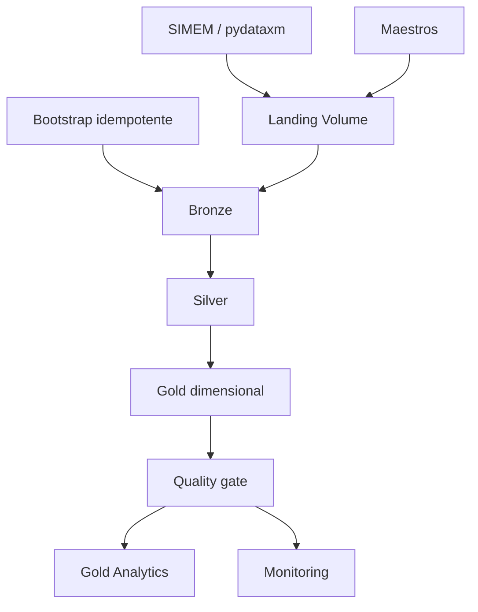

# Arquitectura actual

El catálogo y ambiente llegan desde parámetros del bundle. Las rutas se
resuelven desde `${workspace.file_path}` y no dependen de correos personales.

| Hecho | Grano |
|---|---|
| `fact_generacion_real` | hora, planta y agente |
| `fact_disponibilidad_planta` | hora y planta |
| `fact_demanda_real` | hora, agente, mercado y variable en la clave |
| `fact_precio_bolsa` | hora |
| `fact_energia_embalsada_planta` | día y planta |

La regla TX vigente usa `TXF=10000`, `TXR=9000`, `TXn=n×100`; requiere
validación oficial. Astro es todavía una presentación estática sin serving.
